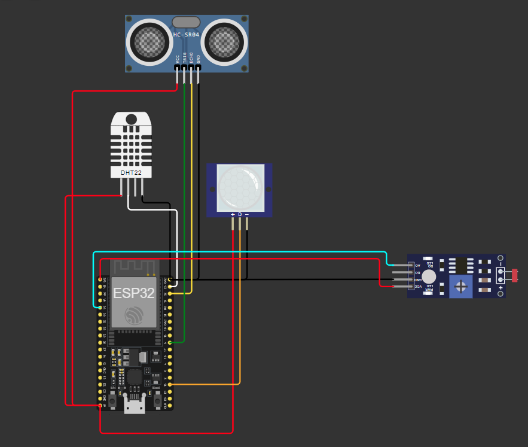

#  Sistema Inteligente de Monitoramento Agrícola com ESP32
## Objetivo
O objetivo deste projeto é desenvolver um sistema inteligente de monitoramento agrícola utilizando o microcontrolador ESP32 e sensores diversos. O sistema coletará dados do ambiente em tempo real e tomará decisões automatizadas para otimizar o uso de recursos, como água e luz, em uma área agrícola. O sistema também poderá ser utilizado para segurança e vigilância.

##  **Repositório no GitHub**
O projeto foi organizado da seguinte forma:
- `/src`: Diretório contendo os códigos-fonte.
- `/docs`: Documentação detalhada do sistema e dos sensores.
- `/tests`: Testes manuais ou automatizados para validação do sistema
  
 O código foi  comentado para facilitar o entendimento. Cada função e interação com os sensores possui descrições claras, explicando o papel de linha do sistema.
#### Dependências
DHT sensor library para o sensor DHT22.

## Sensores utilizados
#### 1. Sensor de umidade e temperatura (DHT22)
- **Descrição**: Sensor que mede a temperatura e a umidade do ambiente.
- **Pinos**:
  - **VCC**: Conectado ao pino de alimentação VCC 5V 
  - **GND**: Conectado ao pino terra GND 2 
  - **Data**: Conectado a um pino digital GPIO 23
- **Uso**: Monitoramento climático. Mede continuamente a umidade e temperatura do ambiente. Com base nesses dados, o sistema pode ajusta a quantidade de agua da irrigação e envia alertas quando as condições climáticas mudam drasticamente.

#### 2. Sensor de ultrassom (HC-SR04)
- **Descrição**: Sensor que mede a distância de objetos, usado para monitorar o nível de água.
- **Pinos**:
  - **VCC**: Conectado ao pino de alimentação VCC 5V
  - **GND**: Conectado ao pino terra GND 2
  - **Trig**: Conectado ao pino digital GPIO 5
  - **Echo**: Conectado ao pino digital GPIO 22
- **Uso**: Controle de irrigação automatizada. Monitora o nível de água no reservatório, garantindo que a irrigação só seja ativada quando o nível de água for adequado, evitando desperdício.

#### 3. Sensor de movimento (PIR)
- **Descrição**: Sensor que detecta movimento, útil para segurança e vigilância.
- **Pinos**:
  - **VCC**: Conectado ao pino de alimentação VCC de 5V
  - **GND**: Conectado ao pino terra GND 2
  - **Out**: Conectado a o pino digital GPIO 34
- **Uso**: Detecção de presença. Monitora a presença de pessoas ou animais durante o período da noite, reportando as atividades para segurança.

#### 4. Sensor de luz (LDR)
- **Descrição**: Resistor dependente de luz que mede a intensidade da luz solar.
- **Pinos**:
  - **VCC**: Conectado ao pino de alimentação VCC 3.3V
  - **GND**: Conectado ao pino terra GND 2
  - **AO**: Conectado a o pino analógico GPIO 15
- **Uso**: Ajuste de irrigação com base na luminosidade. mede Mede a quantidade de luz solar, permitindo que o sistema ajuste automaticamente a quantidade de água usada para irrigação com base na luz recebida pelas plantas, aumentando em dias nublados e reduzindo em dias mais ensolarados.

## Gabarito de cores dos fios

| Função    | Cor do Fio               |
|-----------|--------------------------|
| **VCC**   | Vermelho                 |
| **GND**   | Preto                    |
| **Echo**  | Amarelo                  |
| **Trig**  | Verde                    |
| **Out**   | Laranja                  |
| **SDA**   | Branco                   |
| **AO (Analógico)** |  Azul Claro     |
| **DO (Digital)** | Roxo              |

## Desenho do circuito

## Cofigurando o projeto

### 1. **Plataforma de simulação: como configurar e rodar o projeto no Wokwi com o ESP32**
O projeto pode  ser simulado na plataforma [Wokwi.com](https://wokwi.com/) com o microcontrolador ESP32. O circuito todo foi montado de acordo com as configurações detalhadas nos sensores. 
- Acesse o [link](https://wokwi.com/projects/412236037188911105) do projeto Wokwi.
  - Ao abrir o projeto, certifique-se de que todos os sensores estão corretamente conectados conforme o circuito.
  - Clique em "Start Simulation" para iniciar a simulação.
  - Acompanhe os dados no Monitor Serial clicando no ícone do monitor para verificar os resultados da leitura dos sensores.

### 2. **Plataforma física: como configurar e rodar o projeto com o ESP32** 

## Testes realizados
- 20-10-2024  - teste se o código inicial de configuração dos sensores rodava normalmente